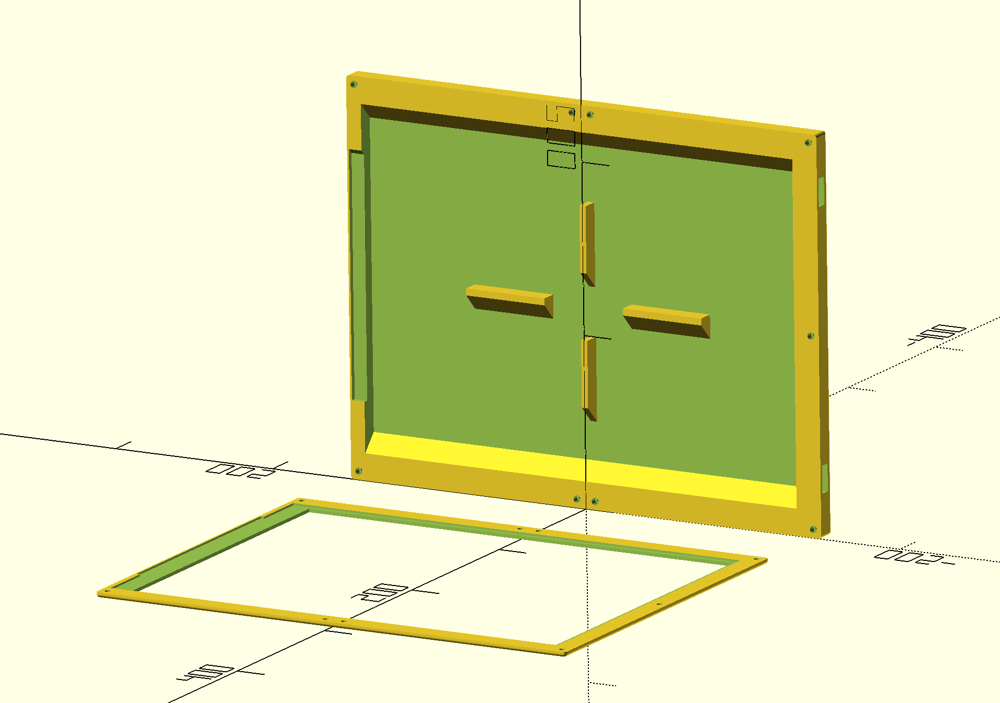

# FrameOS parametric cases

## Mark 1

- Parametric design - change any dimension and regenerate
- Two part design where the lid screws to the body with heat set inserts
- Custom number of screws on any edge
- Kickstand for tabletop usage
- Large 13" frames optimized for vertical printing without supports

### Waveshare 7.3" E Spectra 6 color

Features a kickstand

- [stl](https://github.com/FrameOS/cases/blob/main/mark1/exports/7in3e.stl), [3mf](https://github.com/FrameOS/cases/blob/main/mark1/exports/7in3e.3mf)

### Waveshare 13.3" E Spectra 6 color

**Note:** beware of shrinkage when printing vertically! Scale your model up by 1mm before printing to combat this!

- [stl](https://github.com/FrameOS/cases/blob/main/mark1/exports/13in3e-upright.stl)

### Inspiration

This model was inspired by [this case](https://www.printables.com/model/76756-waveshare-75-screen-case) and [its remix](https://www.printables.com/model/82001-waveshare-75-screen-case-remix), yet is reimplemented from scratch.
