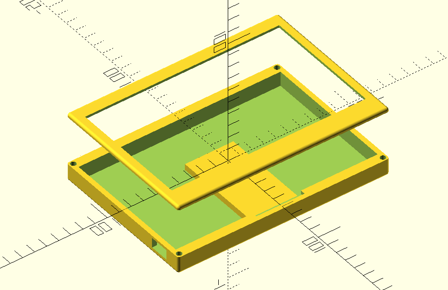

# FrameOS parametric cases

## Mark 1

Inspired by [this case](https://www.printables.com/model/82001-waveshare-75-screen-case-remix), though reimplemented from scratch with new features added.

Features:
- Parametric design - change any dimension and regenerate
- Two part design where the lid screws to the body with heat set inserts
- Custom number of screws on any edge
- Kickstand for tabletop usage

Exported models:

- Waveshare 7.3" E - [stl](https://github.com/FrameOS/cases/blob/main/mark1/exports/7in3e.stl), [3mf](https://github.com/FrameOS/cases/blob/main/mark1/exports/7in3e.3mf)
