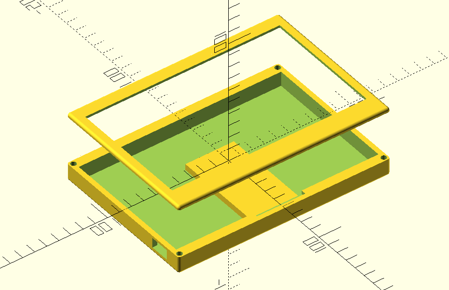
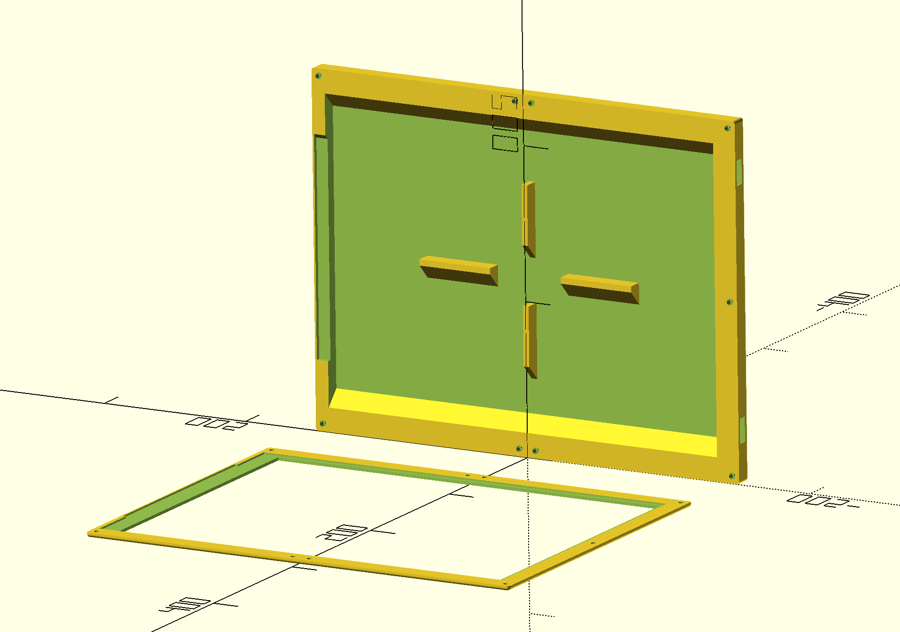

# FrameOS parametric cases

https://cases.frameos.net/

## Case 1

- Parametric design - change any dimension and regenerate
- Two part design where the lid screws to the body with heat set inserts
- Designed for vertical printing without supports
- Print in place kickstand
- USB cutout hole in the back
- Hole for hanging the frame on the wall
- Custom number of screws on any edge
- Custom cutouts on any side

### Waveshare 7.3" E Spectra 6 color

Features a kickstand. The case depth for electronics is 12mm.

### Waveshare 13.3" E Spectra 6 color

The case depth for electronics is 10mm.

## Developing locally

Install [OpenSCAD](https://openscad.org/), clone the repo, and open any of the `.scad` files directly.
