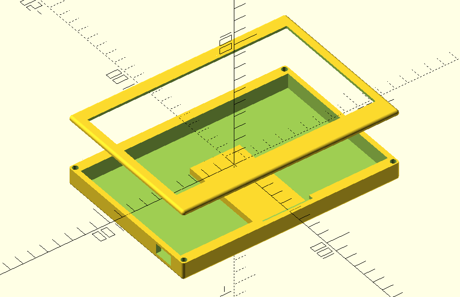
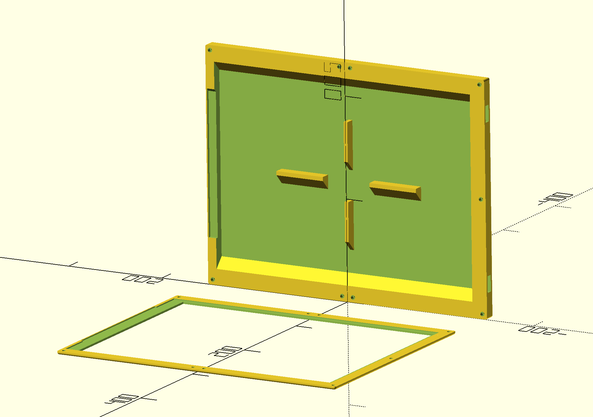

# FrameOS parametric cases

https://cases.frameos.net/

## Case 1

- Parametric design - change any dimension and regenerate
- Two part design where the lid screws to the body with heat set inserts
- Designed for vertical printing without supports
- Print in place kickstand
- USB cutout hole in the back
- Hole for hanging the frame on the wall
- Custom number of screws on any edge
- Custom cutouts on any side

### Waveshare 7.3" E Spectra 6 color

Features a kickstand. The case depth for electronics is 12mm.



### Waveshare 13.3" E Spectra 6 color

The case depth for electronics is 10mm.



## Developing locally

Install [Flox](https://flox.dev/), clone the repo, and activate the project environment:

```sh
flox activate
```

Open any of the `.scad` files directly from that shell, or run the build:

```sh
npm run build
```

## Visual regression snapshots

Render all `.scad` files from `cases/` at the tracked camera angles. The Flox environment uses OpenSCAD unstable/nightly, and the visual regression renderer uses full OpenSCAD rendering instead of preview rendering. By default this writes `4000x3000` PNGs for `iso-front`, `iso-back`, `top`, and `bottom`:

```sh
flox activate -- npm run render:visual
```

Check that the generated snapshots match git:

```sh
flox activate -- npm run test:visual
```

The snapshots are written to `visual-regressions/`. GitHub Actions runs the same check and fails when rendering changes any tracked PNG, deletes a stale PNG, or creates a new untracked PNG.
